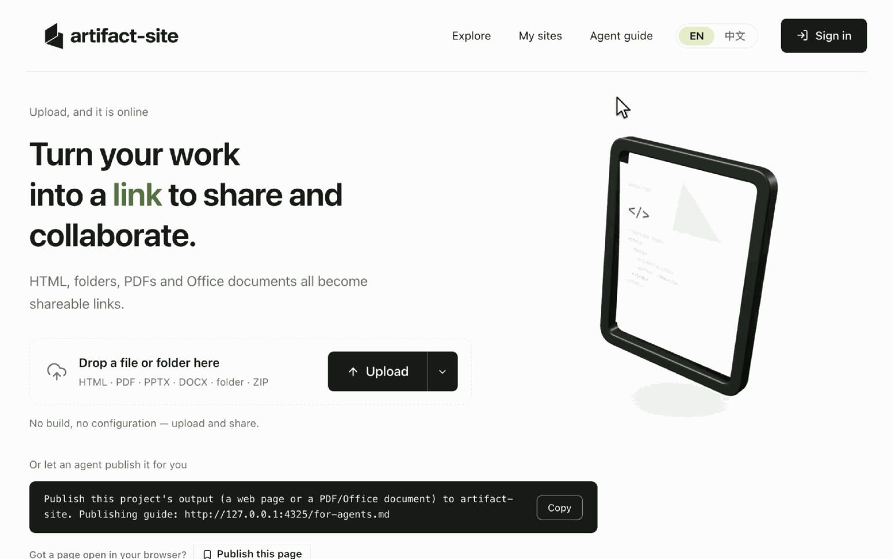
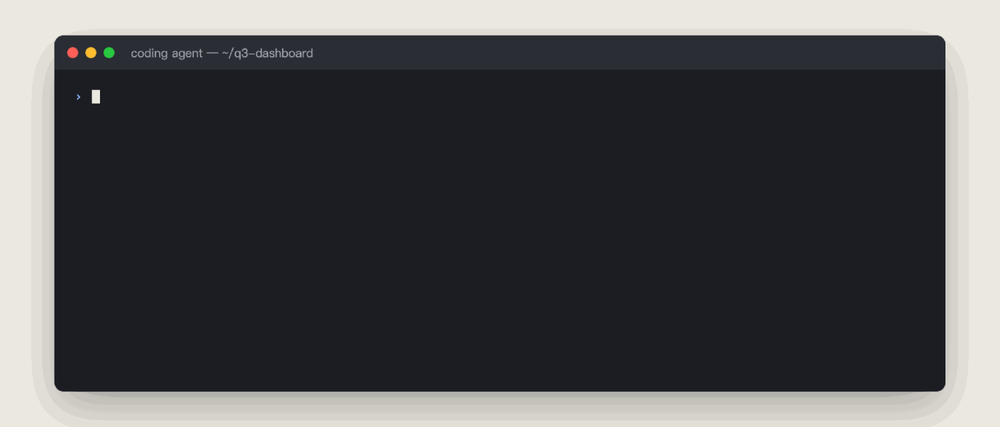

<p align="center">
  <picture>
    <source media="(prefers-color-scheme: dark)" srcset="docs/assets/artifact-site-banner-dark.png">
    <source media="(prefers-color-scheme: light)" srcset="docs/assets/artifact-site-banner.png">
    
  </picture>
</p>

<h1 align="center">artifact-site</h1>

<p align="center">
  <strong>English</strong> |
  <a href="docs/README.zh-CN.md">简体中文</a> |
  <a href="docs/README.ja.md">日本語</a> |
  <a href="docs/README.de.md">Deutsch</a> |
  <a href="docs/README.fr.md">Français</a> |
  <a href="docs/README.es.md">Español</a>
</p>

<p align="center">
  <a href="https://github.com/lexmount/artifact-site/actions/workflows/ci.yml"></a>
  <a href="#license"></a>
  <a href=".nvmrc"></a>
  <a href="ROADMAP.md"></a>
  <a href="https://www.npmjs.com/package/@artifact-site/cli"></a>
  <a href="https://github.com/lexmount/artifact-site/releases/latest"></a>
</p>

There are now so many AI agents to choose from, but their output is scattered across your computer, chat histories and different platforms’ clouds, making it hard to organize, share and revisit.

**artifact-site is a self-hosted workspace for individuals and teams, similar to Claude Artifacts or OpenAI Sites.** Your various agents create the work; artifact-site brings it together, turning pages and documents into links for sharing, comments and feedback, access control and version history. The agents you already use can keep editing, publishing, searching and updating that work through the CLI or MCP.

> **[Try the live demo](https://artifact-site.app.lexmount.com/)** — no installation needed. Drag and drop a file to publish it and get a shareable link. Try it anonymously, or **sign in with Google or GitHub** to keep your sites, organize them in folders and control who can open each link.
>
> Anonymous uploads expire after a few days. This is a public demo; please do not upload sensitive information.

<p align="center"></p>
<p align="center"><sub><b>Drop a file, get a link, share it.</b> View your published work online and choose who can open it in the sharing settings.</sub></p>

## Why artifact-site

- **Keep work in one place.** Organize pages and documents in folders and find them with full-text search, including Chinese. Team members and agents can find the work they have permission to access.
- **Drop it in and share it.** Upload HTML, a build folder, a ZIP or a document to get a link. Large sites upload in chunks. Share with everyone, signed-in users, named people or passcode holders.
- **Keep improving published work.** Edit HTML text or source in the browser, or let an agent update the whole site. Each change keeps a version, with rollback and the option to save a copy.
- **Let agents pick up where they left off.** Publish and update through the guide, CLI or MCP, then search by content and read extractable text. For example, find a previous report and update it at the same address for your team to view.

## How it compares

| For your team | Claude Artifacts / Claude Code Artifacts | ChatGPT Sites (OpenAI) | artifact-site |
| --- | --- | --- | --- |
| Hosting | Anthropic-managed | OpenAI-managed | **Your server**, with local or S3-compatible file storage |
| Publishing workflow | Within Claude / Claude Code | Within ChatGPT Sites | **Any tool** via file upload, CLI or remote MCP |
| Content focus | Interactive artifacts | Hosted websites and apps | Static HTML, build folders, ZIPs, PDF and Office documents¹ |
| Identity | Claude accounts | ChatGPT accounts | **Your OIDC provider**, such as Google, Keycloak or Okta |

¹ Office online preview requires Gotenberg. artifact-site hosts finished files; it does not run application backends or build jobs.

Claude Artifacts and ChatGPT Sites combine creation and hosted sharing. artifact-site complements those workflows with a shared home on your own infrastructure for pages and documents produced by different tools.

Product scope and sharing vary by plan and evolve; see the official [Claude Artifacts](https://support.claude.com/en/articles/9487310-what-are-artifacts-and-how-do-i-use-them) and [ChatGPT Sites](https://learn.chatgpt.com/docs/sites) guides.

## Contents

- [What you can publish](#what-you-can-publish)
- [Quick start (local deployment)](#quick-start-local-deployment)
- [Connect a coding agent](#connect-a-coding-agent)
- [Deploy for your team](#deploy-for-your-team)
- [How it works](#how-it-works)
- [Documentation](#documentation)
- [Contributing](#contributing)
- [License](#license)

## What you can publish

| Content | What you can do |
| --- | --- |
| HTML, static site folders, ZIPs | Upload and preview single-page or multi-page sites, including build output such as `dist/`. HTML pages support visual text editing and source editing. |
| PDF | Read online, search and extract text. |
| Office documents, such as PPTX and DOCX | Store and download originals; enable Gotenberg for online preview. |

Build web projects into static files before uploading; the platform does not run application backends or build jobs. PDF and Office documents do not support visual HTML editing, and scanned images are not automatically OCRed.

Hosted pages run in a sandbox and cannot use the platform's login session. External API connections require an origin allowlist. See the [runtime limits](src/content/publish-skill.md) and [security design](SECURITY.md).

## Quick start (local deployment)

To try it, use the [live demo](https://artifact-site.app.lexmount.com/) without installing anything. To deploy locally, run the three commands below. You need Git, Make, Bash, Docker 24+ and the Compose plugin 2.24+. On macOS, use Docker Desktop; on Windows, run the commands inside WSL2 with Docker Desktop’s WSL integration enabled. No Node installation, domain or identity provider is needed.

```bash
git clone https://github.com/lexmount/artifact-site.git && cd artifact-site
cp .env.example .env
make build up
```

Once started, open **http://127.0.0.1:4300** and drop in HTML, a static site folder or a PDF to view your work. New sites are private by default; create a link with the desired access in Sharing before sending it to someone else.

The first run downloads dependencies and builds the image, then starts the app and Postgres. Use these commands in a fresh clone. The service is local-only by default; `make down` stops it and retains data. To make it reachable by your team, follow [Deploy for your team](#deploy-for-your-team).

<details>
<summary>Need a file to try? Create a sample page</summary>

```bash
printf '<!doctype html><meta charset="utf-8"><title>Hello</title><h1>Hello, artifact-site!</h1>' > hello.html
```

Drop `hello.html` onto the home page (or choose **Upload**). You should see “Hello, artifact-site!”. Copy a link from the sharing settings; local-deployment links only open on the same machine.

</details>

## Connect a coding agent

Choose the entry point that fits your agent:

- **Skill**: `npx skills add lexmount/artifact-site` — install the [agent skill](skills/artifact-site/SKILL.md) and give your agent your server URL.
- **CLI**: `npm install -g @artifact-site/cli` — requires Node 24+; use the commands below.
- **MCP**: `https://your-server/mcp` — connect ChatGPT, Claude or another MCP client through the server’s OAuth sign-in; no CLI installation required.

**CLI and MCP publishing create a public share by default.** Use `--share none` (CLI) or `share: false` (MCP) to publish without sharing.

<p align="center"></p>
<p align="center"><sub><b>Or let your coding agent do it.</b> With the agent guide (<code>/for-agents.md</code>), the CLI or the MCP server, "publish this and give me a link" is one instruction — and the site can be updated, searched and read the same way.</sub></p>

Give this instruction to Claude Code, Cursor, Codex or another coding agent that can read URLs, using a server address it can reach. The home page also provides a copy button with your server address filled in:

```text
Publish this project's output to artifact-site. Publishing guide: https://your-server/for-agents.md
```

CLI examples (`login` requires OIDC):

```bash
artifact-site login --base https://your-server        # one-time device sign-in
artifact-site publish dist/ --title "Q3 dashboard"    # publish and return links
artifact-site find "quota"                           # search by content
artifact-site read YOUR_SITE_SLUG                    # replace with a site slug to read its text
```

<details>
<summary>Authentication details</summary>

Open **Agent guide** on your deployment to choose the prompt, CLI or MCP path. `/for-agents#cli` and `/for-agents#mcp` provide server-specific commands, authentication steps and client configuration. Remote MCP authenticates every request: ChatGPT, Claude and other OAuth-capable clients sign in through the server's own consent page, other clients carry a personal token. CLI publishing, updating, sharing and deleting require a token; publishing creates a public share by default. Use `--share none` (CLI) or `share: false` (MCP) to skip sharing.

Team deployments with OIDC support device sign-in approval; the anonymous local setup above does not require it. The agent follows the guide and the server's publishing policy to choose authentication. A cloud agent cannot directly reach `127.0.0.1` on your computer.

The login example requires OIDC. Remote MCP is a separate, complete entry point at
`https://your-server/mcp`: no CLI installation is required. ChatGPT, Claude and any client that
implements MCP authorization connect with the address alone and sign in through the server's
OAuth consent page; for other clients, the deployment's `/for-agents#mcp` page creates a
personal token and copies the authenticated configuration. It supports publishing, updating,
search, read, sharing, versions, export and deletion, including binary files and directory
uploads through MCP tools.

See [CLI commands](cli/README.md) and [remote MCP setup and tools](docs/MCP.md).

</details>

## Deploy for your team

Start from [.env.example](.env.example) and follow [SELFHOST.md](SELFHOST.md) for a production deployment. Use a stable public address for `ARTIFACT_PUBLIC_URL`: sign-in callbacks, request-origin checks and the address given to agents derive from it:

- Set a reachable `ARTIFACT_PUBLIC_URL` and configure a reverse proxy, or set `ARTIFACT_WITH_CADDY=on` with `ARTIFACT_DOMAIN` to enable Caddy and automatic certificates.
- Choose a publishing policy. `login` requires OIDC; `token` serves scripts or agents with a Bearer token; `open` lets anyone who can reach the service publish and suits trusted internal networks. Anonymous publishing supports separate quotas and expiry.
- Connect Google or an OIDC provider such as Keycloak, Logto, Authentik, Okta or Auth0. Accounts own sites and folders; agents can receive long-lived tokens through device sign-in. The default `ARTIFACT_ENFORCE_OWNERSHIP=on` enables account-based access control once OIDC is configured. Add administrators' verified sign-in emails to `ARTIFACT_ADMIN_EMAILS` to enable the admin console.
- Enable Office preview with `ARTIFACT_WITH_GOTENBERG=on`. The admin console manages take-downs, quotas, anonymous-site expiry and policy switches. Choose default visibility and schedule backups.

The app ships as one Docker image with bundled Postgres in the single-host setup. To use an available prebuilt image, set `ARTIFACT_IMAGE` and run `make pull`. `make doctor` checks configuration; `make backup` and `make restore` handle backups and recovery. For multiple replicas, external Postgres and S3-compatible storage, see [DEPLOY.md](DEPLOY.md).

## How it works

- **Application and storage.** Next.js serves the UI and API, Postgres stores metadata, and files live on local disk or S3-compatible storage. External database and object storage support multiple app replicas.
- **Immutable versions.** Each upload or edit writes a new file version, preserving historical content. Optimistic locking (`expected_version`) detects concurrent update conflicts.
- **Content isolation.** Previews use sandboxed iframes without `allow-same-origin` and a restrictive CSP to isolate uploaded content from the platform. Path checks and decompression limits defend against path traversal and ZIP bombs.

See [ARCHITECTURE.md](ARCHITECTURE.md) for the architecture, data model and request flows.

## Documentation

| Document | What it covers |
| --- | --- |
| [SELFHOST.md](SELFHOST.md) | Single-machine deployment with `make up`, backups, upgrades, FAQ |
| [DEPLOY.md](DEPLOY.md) | Multi-replica deployment: external Postgres, object storage, OIDC |
| [.env.example](.env.example) | Every setting, grouped and explained |
| [ARCHITECTURE.md](ARCHITECTURE.md) | System shape, data model, request paths, the sandbox |
| [SECURITY.md](SECURITY.md) | Threat model and how to report a vulnerability |
| [cli/README.md](cli/README.md) | The CLI |
| [src/content/publish-skill.md](src/content/publish-skill.md) | The API contract and hosting limits, as served to agents |
| [ROADMAP.md](ROADMAP.md) | What comes next: semantic search, comments on sites, and more |
| [CHANGELOG.md](CHANGELOG.md) | What changed, release by release |

## Contributing

Local development requires Node 24+ and Docker:

```bash
npm install
make dev          # start a disposable Postgres and the development server
npm test          # unit tests, no external services needed
```

See [CONTRIBUTING.md](CONTRIBUTING.md) for the contribution process, DCO sign-off and CI requirements. Report bugs and ideas in [issues](https://github.com/lexmount/artifact-site/issues); ask questions in [discussions](https://github.com/lexmount/artifact-site/discussions).

If artifact-site is useful to you, a ⭐ helps others find it. Using it with your team? Say hi in [Discussions](https://github.com/lexmount/artifact-site/discussions) — we’d love to list you.

## License

Licensed under either of

- Apache License, Version 2.0 ([LICENSE-APACHE](LICENSE-APACHE))
- MIT license ([LICENSE-MIT](LICENSE-MIT))

at your option. Unless you explicitly state otherwise, any contribution intentionally submitted for inclusion in this project by you shall be dual-licensed as above, without any additional terms or conditions.

© 2025–2026 LexMount. Third-party components are listed in [NOTICE](NOTICE).
