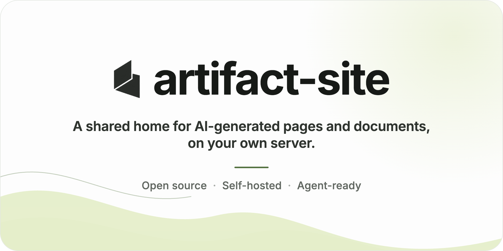
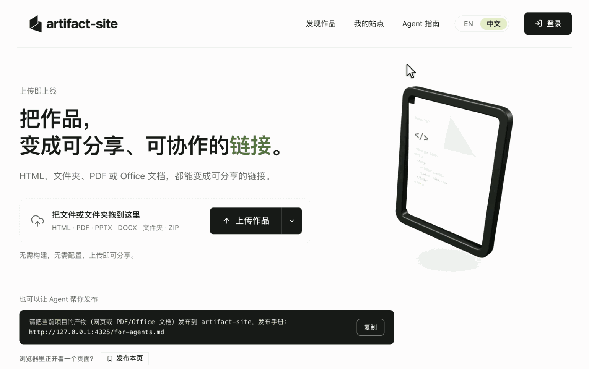
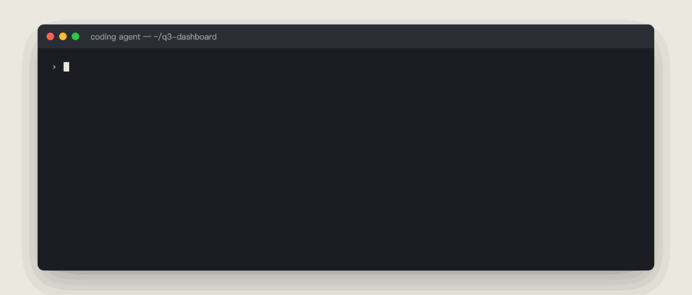

<p align="center">
  <picture>
    <source media="(prefers-color-scheme: dark)" srcset="assets/artifact-site-banner-dark.png">
    <source media="(prefers-color-scheme: light)" srcset="assets/artifact-site-banner.png">
    
  </picture>
</p>

<h1 align="center">artifact-site</h1>

<p align="center">
  <a href="../README.md">English</a> |
  <strong>简体中文</strong> |
  <a href="README.ja.md">日本語</a> |
  <a href="README.de.md">Deutsch</a> |
  <a href="README.fr.md">Français</a> |
  <a href="README.es.md">Español</a>
</p>

<p align="center">
  <a href="https://github.com/lexmount/artifact-site/actions/workflows/ci.yml"></a>
  <a href="#协议"></a>
  <a href="../.nvmrc"></a>
  <a href="../ROADMAP.md"></a>
</p>

<p align="center"><sub>本文档与 <a href="../README.md">英文版</a> 同步维护；如有出入，以英文版为准。</sub></p>

AI 越来越擅长生成东西：一张交互图表、一份分析报告、一个网页原型、一套幻灯片。但这些作品往往散落在聊天记录、本地目录和不同工具里，缺少一个集中查看、分享和继续维护的地方。发给别人看还要部署、传文件或截图；过一阵再找，又不容易确认哪个是最新版本。

**artifact-site 把这些作品集中到你自己的服务器上，变成可分享、可更新、可检索的链接。** 可以把它理解成团队自托管的、类似 Claude Artifacts 或 OpenAI Sites 的作品空间：作品由你选择的 AI 工具或内部工具生成，artifact-site 负责发布和管理。上传 HTML、静态网站或文档后，团队可以在线查看、设置访问权限并保留版本；coding agent 也能发布、更新、搜索和读取已有作品。

<p align="center"></p>
<p align="center"><sub><b>拖进来，拿链接，分享出去。</b>在线查看刚发布的作品，通过分享设置决定谁能打开。</sub></p>

## 为什么使用 artifact-site

- **把作品集中起来。** 用文件夹整理网页和文档，通过全文搜索找回内容，中文也能搜。团队成员和 agent 都能找到自己有权访问的作品。
- **拖进来，就能分享。** 上传 HTML、构建目录、ZIP 或文档，获得一个链接；大站点支持分块上传。可以分享给任何人、登录用户、指定的人，或持有访问码的人。
- **发布之后还能继续改。** 在浏览器里编辑 HTML 页面的文字或源码，也可以让 agent 更新整个站点。每次修改保留版本，支持回滚和另存为新作品。
- **让 agent 接着用。** 通过发布指南、CLI 或 MCP 发布和更新，也能按内容搜索、读取可提取的正文。例如，找到上次发布的报告，在同一个地址更新，团队就能查看新版本。

## 目录

- [支持的内容](#支持的内容)
- [快速开始（本地部署）](#快速开始本地部署)
- [接入 coding agent](#接入-coding-agent)
- [团队部署](#团队部署)
- [工作原理](#工作原理)
- [文档](#文档)
- [参与贡献](#参与贡献)
- [协议](#协议)

## 支持的内容

| 内容 | 你可以做什么 |
| --- | --- |
| HTML、静态网站目录、ZIP | 上传并预览单页或多页网站；支持 `dist/` 等构建输出目录。HTML 页面支持可视化文字编辑和源码编辑。 |
| PDF | 在线阅读、搜索和提取正文。 |
| Office 文档（如 PPTX、DOCX） | 保存和下载原文件；启用 Gotenberg 转换服务后可在线预览。 |

网页项目需要先构建为静态文件，平台不运行应用的后端服务或构建任务。PDF 和 Office 文档不支持网页式可视化编辑，扫描件不自动进行 OCR。

托管页面在沙箱中运行，不能使用平台的登录状态；连接外部 API 需要配置允许的来源。详见[运行限制](../src/content/publish-skill.md)和[安全设计](../SECURITY.md)。

## 快速开始（本地部署）

准备好 Git、Make、Docker 24+ 和 Compose 插件 2.24+，在 Linux 机器上执行以下命令即可。无需安装 Node，也无需配置域名或登录服务。

```bash
git clone https://github.com/lexmount/artifact-site.git && cd artifact-site
cp .env.example .env
make build up
```

启动后打开 **http://127.0.0.1:4300**，拖入 HTML、静态网站目录或 PDF，即可查看作品。新作品默认私有；在分享设置中创建允许访问的链接，再复制给别人。

首次运行需要下载依赖和构建镜像，应用与 Postgres 会一起启动。以上命令用于新克隆的目录；服务默认仅本机可访问，停止用 `make down`，数据会保留。要让团队访问，请按[团队部署](#团队部署)配置。

<details>
<summary>手边没有文件？生成一个示例页面</summary>

```bash
printf '<!doctype html><meta charset="utf-8"><title>Hello</title><h1>Hello, artifact-site!</h1>' > hello.html
```

将 `hello.html` 拖入首页（或点**上传作品**），应看到“Hello, artifact-site!”。在分享设置中复制链接；本地部署的链接只能在同一台机器上打开。

</details>

## 接入 coding agent

打开部署后的 **Agent 指南**，选择交给 Agent、CLI 或 MCP。`/for-agents#cli` 和 `/for-agents#mcp` 提供当前服务器的命令、认证步骤与客户端配置。远程 MCP 的每次请求都要认证：ChatGPT、Claude 等支持 OAuth 的客户端通过本服务自己的授权页登录，其他客户端携带个人 Token；CLI 发布、更新、分享和删除需要 Token；发布默认创建公开分享，不分享时使用 `--share none`（CLI）或 `share: false`（MCP）。

<p align="center"></p>
<p align="center"><sub><b>或者交给你的 coding agent。</b>有了 agent 指南（<code>/for-agents.md</code>）、CLI 或 MCP 服务，"把这个发布了给我个链接"就是一句话的事——之后的更新、搜索、读取也一样。</sub></p>

把下面这句交给 Claude Code、Cursor、Codex 或其他能读取 URL 的 coding agent，替换成它可以访问的服务器地址。首页也提供填好地址的复制按钮：

```text
请把当前项目的产物发布到 artifact-site，发布手册：https://你的服务器/for-agents.md
```

配置了 OIDC 的团队部署支持设备登录授权；本地匿名体验不需要这个步骤。agent 根据指南和服务器的发布策略选择认证方式。云端 agent 无法直接访问你电脑上的 `127.0.0.1`。

CLI 需要 Node 24+。用 `npm install -g @artifact-site/cli` 安装（细节和 MCP 配置见 [cli/README.md](../cli/README.md)），再运行：

```bash
artifact-site login --base https://your-server        # 一次性设备登录
artifact-site publish dist/ --title "Q3 dashboard"    # 发布并返回链接
artifact-site find "quota"                           # 按内容搜索
artifact-site read YOUR_SITE_SLUG                    # 替换为作品标识，读取正文
```

以上登录示例需要 OIDC。远程 MCP 是另一套完整入口，地址为 `https://your-server/mcp`，无需安装 CLI。
ChatGPT、Claude 等实现了 MCP 授权规范的客户端只需填入这个地址，然后在本服务的 OAuth 授权页登录即可；其他客户端打开部署后的 `/for-agents#mcp`，创建个人 Token 并复制认证配置。之后即可发布、更新、搜索、读取、分享、管理版本、导出和删除。
二进制文件和文件夹也可通过 MCP 工具上传，无需调用 CLI。

完整说明见 [CLI 命令](../cli/README.md)和[远程 MCP 接入及工具](MCP.md)。

## 团队部署

从 [.env.example](../.env.example) 开始，按 [SELFHOST.md](../SELFHOST.md) 配置正式部署。`ARTIFACT_PUBLIC_URL` 会用于登录回调、请求来源校验和 agent 获取的地址，应使用稳定的对外地址：

- 设置团队可访问的 `ARTIFACT_PUBLIC_URL`，并配置反向代理；也可设置 `ARTIFACT_WITH_CADDY=on` 和 `ARTIFACT_DOMAIN`，启用 Caddy 自动管理证书。
- 选择发布策略。`login` 需要 OIDC；`token` 用于持有 Bearer 令牌的脚本或 agent；`open` 允许任何能访问服务的人发布，适用于可信内网；匿名发布可设置独立配额和过期时间。
- 接入 Google 或 Keycloak、Logto、Authentik、Okta、Auth0 等 OIDC 身份源。站点和文件夹归属到账号，agent 可通过设备登录获取长期令牌。默认的 `ARTIFACT_ENFORCE_OWNERSHIP=on` 会在配置 OIDC 后启用账号权限控制，将管理员经过身份源验证的邮箱加入 `ARTIFACT_ADMIN_EMAILS`，启用管理后台。
- 用 `ARTIFACT_WITH_GOTENBERG=on` 启用 Office 在线预览。管理后台支持下架作品、调整配额、匿名作品过期和发布策略。设置默认可见性并安排备份。

应用打包为一个 Docker 镜像，单机部署配套启动 Postgres。使用已有镜像时，可设置 `ARTIFACT_IMAGE` 后运行 `make pull`。`make doctor` 检查配置，`make backup` 和 `make restore` 用于备份恢复。多副本、外部 Postgres 和 S3 兼容存储见 [DEPLOY.md](../DEPLOY.md)。

## 工作原理

- **应用与存储。** Next.js 提供界面和 API，Postgres 存储元数据，文件存储在本机磁盘或 S3 兼容存储中。使用外部数据库与对象存储时，可运行多个应用副本。
- **不可变版本。** 每次上传或编辑写入新的文件版本，保留历史内容。乐观锁（`expected_version`）用于检测并发更新冲突。
- **内容隔离。** 预览使用不带 `allow-same-origin` 的沙箱 iframe 和严格的 CSP，隔离上传内容与平台。路径检查和解压限制用于防御路径穿越与 ZIP 炸弹。

架构、数据模型和请求流程见 [ARCHITECTURE.md](../ARCHITECTURE.md)。

## 文档

| 文档 | 内容 |
| --- | --- |
| [SELFHOST.md](../SELFHOST.md) | 单机部署：`make up`、备份、升级、常见问题 |
| [DEPLOY.md](../DEPLOY.md) | 多副本部署：外部 Postgres、对象存储、OIDC |
| [.env.example](../.env.example) | 全部配置项，分组带说明 |
| [ARCHITECTURE.md](../ARCHITECTURE.md) | 系统架构、数据模型、请求路径、沙箱 |
| [SECURITY.md](../SECURITY.md) | 威胁模型与漏洞报告方式 |
| [cli/README.md](../cli/README.md) | CLI 命令 |
| [src/content/publish-skill.md](../src/content/publish-skill.md) | 下发给 agent 的 API 契约与托管限制 |
| [ROADMAP.md](../ROADMAP.md) | 接下来做什么：语义检索、站点评论等 |
| [CHANGELOG.md](../CHANGELOG.md) | 每个版本改了什么 |

## 参与贡献

本地开发需要 Node 24+ 和 Docker：

```bash
npm install
make dev          # 启动临时 Postgres 和开发服务器
npm test          # 单元测试，不依赖外部服务
```

提交流程、DCO 签名和 CI 要求见 [CONTRIBUTING.md](../CONTRIBUTING.md)。Bug 和建议提交到 [issues](https://github.com/lexmount/artifact-site/issues)，使用问题到 [discussions](https://github.com/lexmount/artifact-site/discussions)。

## 协议

以下两种协议任选其一：

- Apache License 2.0（[LICENSE-APACHE](../LICENSE-APACHE)）
- MIT License（[LICENSE-MIT](../LICENSE-MIT)）

除非你另有声明，你有意提交给本项目的任何贡献都按上述双协议授权，不附加其他条款。

© 2025–2026 LexMount。第三方组件见 [NOTICE](../NOTICE)。
